# StratosTelloPy
Tello DJI opencv python pygame

Inspired by the Damia FUENTES https://github.com/damiafuentes/DJITelloPy, opencv filters and missions/controls buttons have been added to create an HUD (Head Up Display).
controlled by the pygame library.

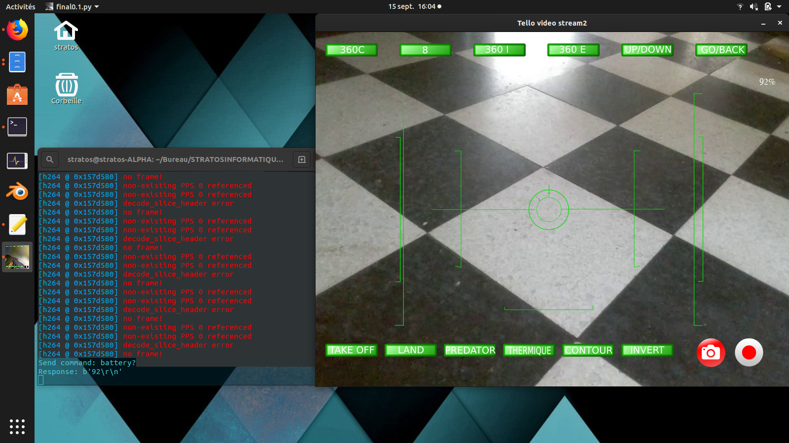

VIDEO

To change the filters up left capital key. To change the filters down CTRL left

To change the view mode up C key To change the view mode down ALT LEFT

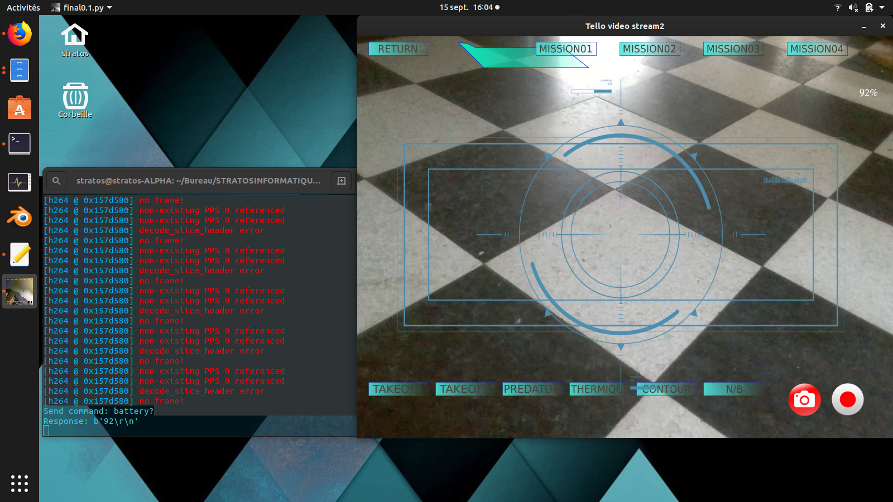

IRON MAN:

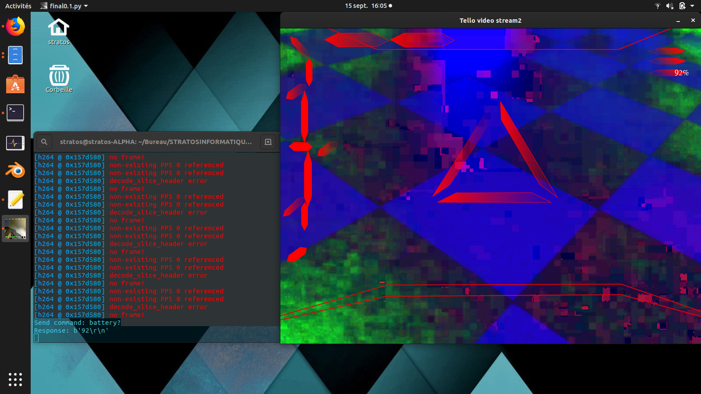

PREDATOR:

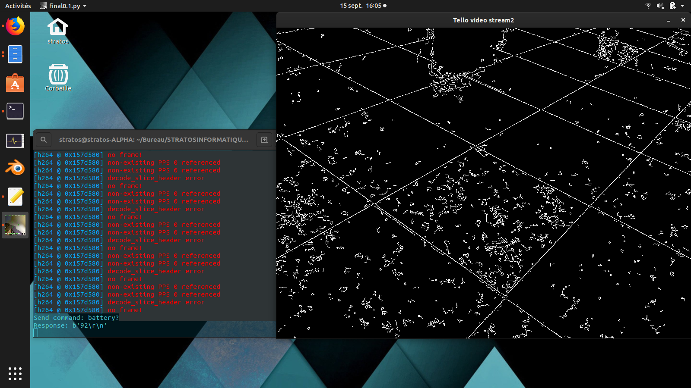

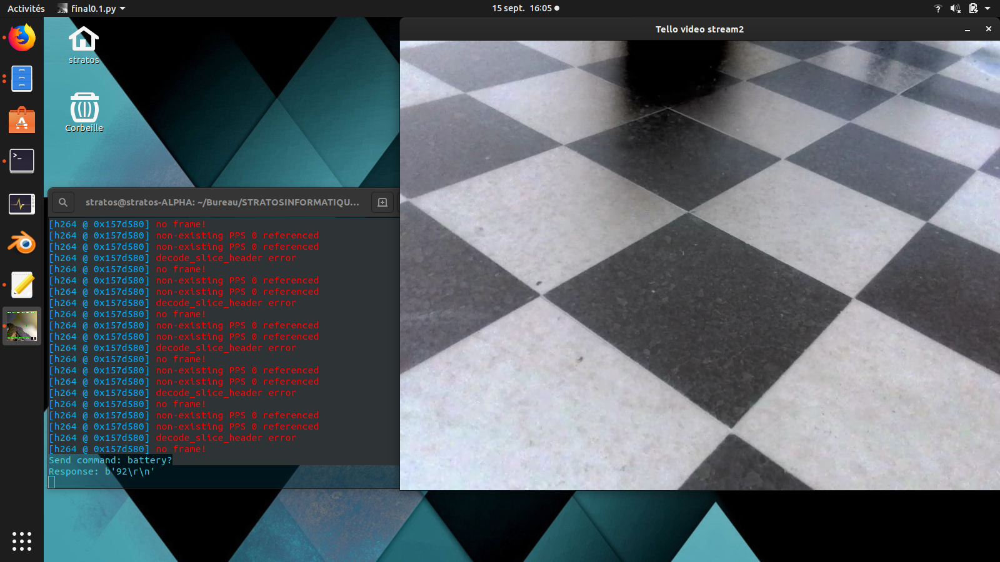

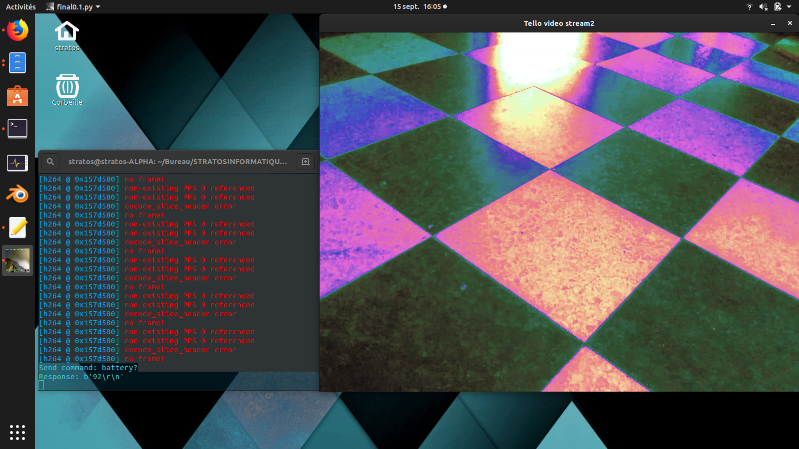

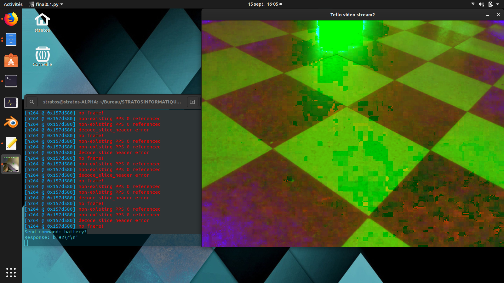

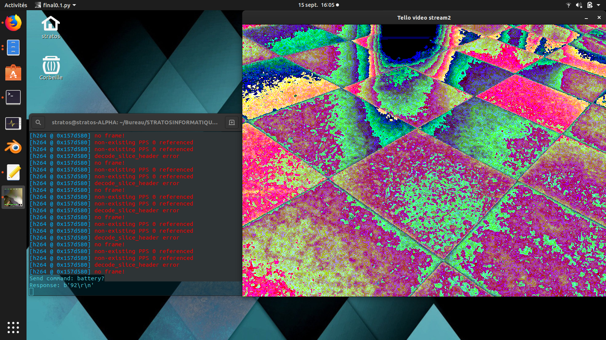

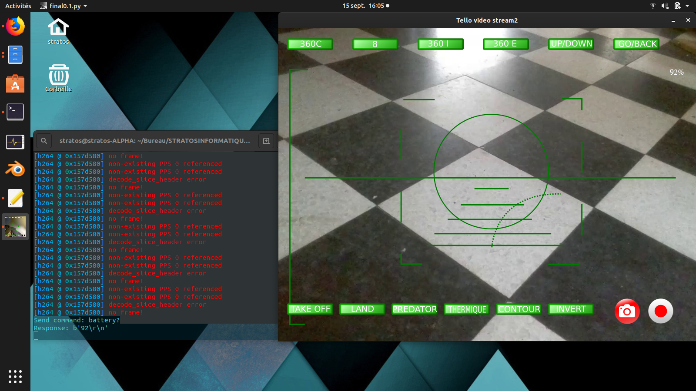

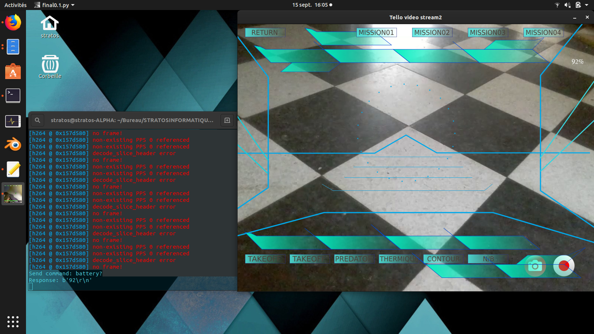

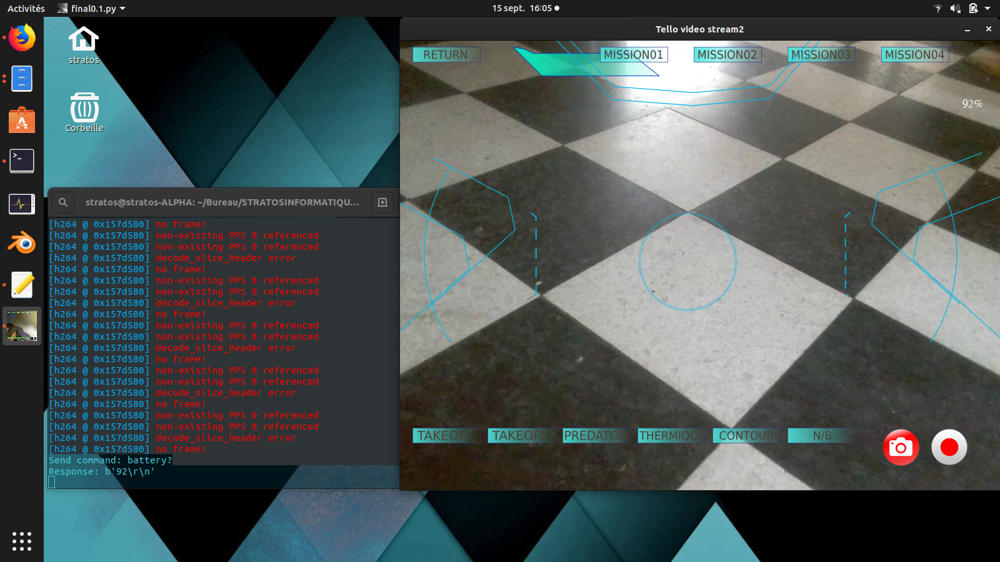

CONTROLS:

up key forward down key backward right right left left

d rotate right a rotate left w up s down

2 backflip 4 rightflip 6 leftflip 8 frontflip

j gamepad/joystick mode (ps4)

x = takeoff
square = change hud
triangle = remise à zéro moteurs
x = takeoff
carre = change hud
triangle = remise zero moteurs
rond atterrissage
joystick g avance recule 
joystick droite gauche
l2 down
r2 up
fleches = flip + direction
share = photo
options = video
ps = remise a zéro des filtres et hud
R1 rotation droite
L1 rotation gauche
esc exit

ENJOY !
If you have any questions i will respond them as soon as i can with pleasure.
Stratos

----------------
STRATOS-ROBOTICS

